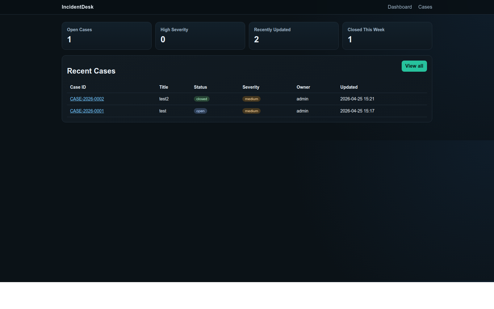
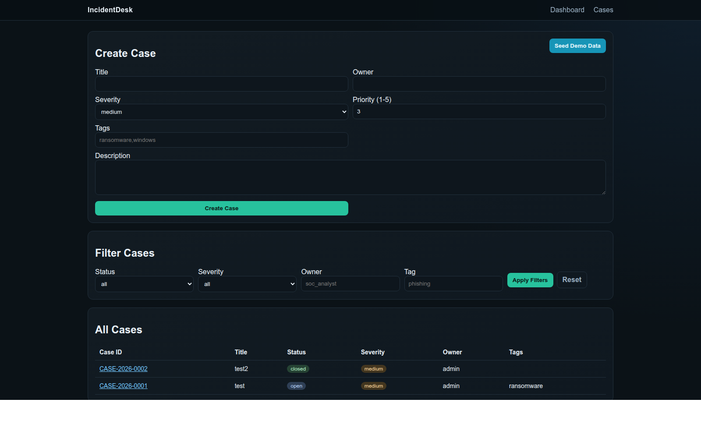
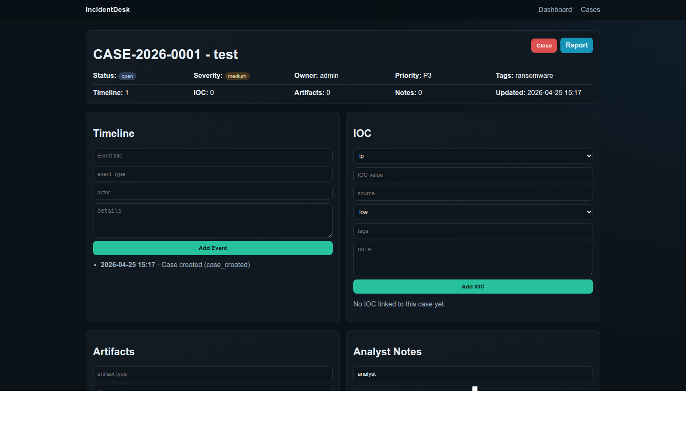
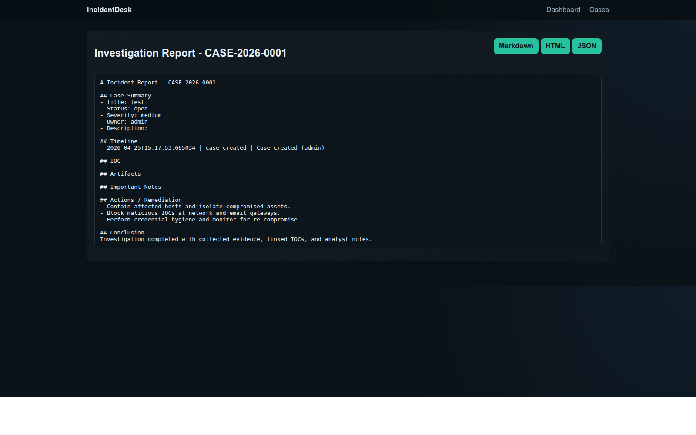

# IncidentDesk

**DFIR case management platform for incident tracking, investigation notes, IOC linkage, and reporting.**

IncidentDesk is a lightweight, defensive DFIR Case Manager built for realistic SOC/IR workflows.
It helps analysts move from initial alert to structured investigation and final report without adding unnecessary enterprise complexity.

## Table of Contents
- [Overview](#overview)
- [Core Capabilities](#core-capabilities)
- [Analyst Workflow](#analyst-workflow)
- [Architecture](#architecture)
- [Tech Stack](#tech-stack)
- [Quickstart](#quickstart)
- [Using Demo Data](#using-demo-data)
- [Web Interface](#web-interface)
- [REST API](#rest-api)
- [Project Quality](#project-quality)
- [Screenshots](#screenshots)
- [Known Limits (MVP)](#known-limits-mvp)
- [Roadmap](#roadmap)
- [Defensive Scope](#defensive-scope)
- [License](#license)

## Overview
IncidentDesk exists to provide a credible, portfolio-grade DFIR application that is:
- defensive by design
- modular and testable
- aligned with real analyst workflows
- technically clean (FastAPI + SQLAlchemy + Alembic)

It is intentionally **not** a SIEM, EDR, malware sandbox, or offensive tooling platform.

## Core Capabilities
- Case lifecycle management: create, update, filter, close, reopen.
- Investigation timeline per case with actor, type, details, and linked context.
- IOC management: IP, domain, URL, hash, CVE, email.
- Artifact tracking: paths, command output, text extracts, links.
- Analyst notes with `important` flag for critical context.
- Investigation reporting in Markdown, HTML, and JSON.
- Dark, responsive web UI for dashboard and investigation views.

## Analyst Workflow
1. Create a case from an alert or intake event.
2. Add timeline milestones during triage and investigation.
3. Link IOCs and artifacts as evidence evolves.
4. Capture analyst notes and highlight important decisions.
5. Close/reopen case depending on investigation outcome.
6. Generate a report for handoff, documentation, or remediation tracking.

## Architecture

```text
incidentdesk/
├── README.md
├── pyproject.toml
├── alembic.ini
├── alembic/
│   └── versions/
├── app/
│   ├── main.py
│   ├── config.py
│   ├── db.py
│   ├── models.py
│   ├── schemas.py
│   ├── services/
│   │   ├── case_service.py
│   │   ├── timeline_service.py
│   │   ├── ioc_service.py
│   │   ├── artifact_service.py
│   │   ├── note_service.py
│   │   ├── report_service.py
│   │   └── demo_service.py
│   ├── routers/
│   │   ├── web.py
│   │   ├── api_cases.py
│   │   ├── api_iocs.py
│   │   ├── api_artifacts.py
│   │   └── api_reports.py
│   ├── templates/
│   ├── static/
│   └── utils/
├── tests/
└── .github/workflows/ci.yml
```

## Tech Stack
- Python 3.11+
- FastAPI
- SQLAlchemy 2.x
- Alembic
- SQLite (MVP default)
- Jinja2 server-side templates
- pytest, ruff, mypy

## Quickstart

```bash
cd incidentdesk
python3 -m venv .venv
source .venv/bin/activate
pip install -e '.[dev]'
alembic upgrade head
uvicorn app.main:app --reload
```

Application URL: `http://127.0.0.1:8000`

## Using Demo Data
A fresh database starts empty by design.

To populate realistic sample investigations:
- Use the **Load Demo Dataset** button on `/` or **Seed Demo Data** on `/cases`.
- Or call the endpoint:

```bash
curl -X POST http://127.0.0.1:8000/demo/seed
```

To reset and reload demo data from UI, use **Reset + Reload Demo**.

## Web Interface
- Dashboard: `/`
- Cases list + creation + filters: `/cases`
- Case detail (timeline, IOC, artifacts, notes): `/cases/{case_id}`
- Report view: `/cases/{case_id}/report`

## REST API

### Cases
- `GET /api/cases`
- `POST /api/cases`
- `GET /api/cases/{case_id}`
- `PATCH /api/cases/{case_id}`
- `POST /api/cases/{case_id}/close`
- `POST /api/cases/{case_id}/reopen`

### Timeline
- `GET /api/cases/{case_id}/timeline`
- `POST /api/cases/{case_id}/timeline`

### IOC
- `GET /api/cases/{case_id}/iocs`
- `POST /api/cases/{case_id}/iocs`
- `PATCH /api/iocs/{ioc_id}`
- `DELETE /api/iocs/{ioc_id}`

### Artifacts
- `GET /api/cases/{case_id}/artifacts`
- `POST /api/cases/{case_id}/artifacts`
- `PATCH /api/artifacts/{artifact_id}`
- `DELETE /api/artifacts/{artifact_id}`

### Notes
- `GET /api/cases/{case_id}/notes`
- `POST /api/cases/{case_id}/notes`

### Reports
- `GET /api/cases/{case_id}/report.md`
- `GET /api/cases/{case_id}/report.html`
- `GET /api/cases/{case_id}/report.json`

## Project Quality
Run local checks:

```bash
ruff check .
mypy app
pytest
```

CI workflow (`.github/workflows/ci.yml`) runs lint, type checks, and tests on push/PR.

## Screenshots
Store UI captures in:
- `docs/screenshots/`

### Dashboard


### Cases


### Case Detail


### Report


## Known Limits (MVP)
- SQLite default only.
- No authentication/authorization yet.
- No binary upload/evidence pipeline.
- HTML report rendering is intentionally simple.

## Roadmap
- Pagination, sorting, and richer filtering.
- RBAC/authentication layer.
- Better IOC search and correlation features.
- Improved reporting templates and optional PDF export.
- Optional integrations (ticketing, intel feeds).

## Defensive Scope
IncidentDesk is strictly defensive and investigation-focused.

Included:
- incident/case tracking
- evidence organization
- IOC linkage and analysis support
- remediation-oriented reporting

Excluded:
- offensive operations
- exploit tooling
- attack automation

## License
MIT. See [LICENSE](LICENSE).
